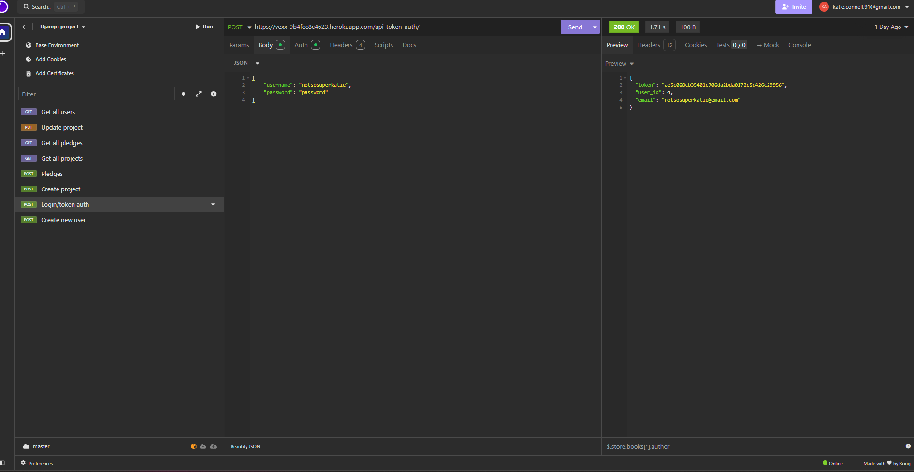

# crowdfunding_back_end
Crowdfunding project back end

# Django Rest Framework Project: Crowdfunding App (Part 1) Due: Last Sunday of the module at 11:59pm.

## Project Description
Kickstarter, Go Fund Me, Kiva, Change.org, Patreon… All of these different websites have something in common: they provide a platform for people to fund projects that they believe in, but they all have a slightly different approach. You are going to create your own crowdfunding website, and put your own spin on it!

## Project Requirements
Your crowdfunding project must:

- [X] Be separated into two distinct projects: an API built using the Django Rest Framework and a website built using React. 
- [X] Have a cool name, bonus points if it includes a pun and/or missing vowels. See https://namelix.com/ for inspiration. (Bonus Points are meaningless)
- [X] Have a clear target audience.
- [X] Have user accounts. A user should have at least the following attributes:
  - [X] Username
  - [X] Email address
  - [X] Password
- [X] Ability to create a “project” to be crowdfunded which will include at least the following attributes:
  - [X] Title
  - [X] Owner (a user)
  - [X] Description
  - [X] Image
  - [X] Target amount to fundraise
  - [x] Whether it is currently open to accepting new supporters or not
  - [X] When the project was created
- [X] Ability to “pledge” to a project. A pledge should include at least the following attributes:
  - [X] An amount
  - [X] The project the pledge is for
  - [X] The supporter/user (i.e. who created the pledge)
  - [X] Whether the pledge is anonymous or not
  - [X] A comment to go along with the pledge
- [X] Implement suitable update/delete functionality, e.g. should a project owner be allowed to update a project description?
- [X] Implement suitable permissions, e.g. who is allowed to delete a pledge?
- [X] Return the relevant status codes for both successful and unsuccessful requests to the API.
- [X] Handle failed requests gracefully (e.g. you should have a custom 404 page rather than the default error page).
- [X] Use Token Authentication, including an endpoint to obtain a token along with the current user's details.
- [ ] Implement responsive design.

## Additional Notes
No additional libraries or frameworks, other than what we use in class, are allowed unless approved by the Lead Mentor.

Note that while this is a crowdfunding website, actual money transactions are out of scope for this project.

## Submission
To submit, fill out [this Google form](https://forms.gle/34ymxgPhdT8YXDgF6), including a link to your Github repo. Your lead mentor will respond with any feedback they can offer, and you can approach the mentoring team if you would like help to make improvements based on this feedback!

Please include the following in your readme doc:
- [X] A link to the deployed project.
- [X] A screenshot of Insomnia, demonstrating a successful GET method for any endpoint.
- [X] A screenshot of Insomnia, demonstrating a successful POST method for any endpoint.
- [X] A screenshot of Insomnia, demonstrating a token being returned.
- [X] Step by step instructions for how to register a new user and create a new project (i.e. endpoints and body data).
- [X] Your refined API specification and Database Schema.

Link to Vexx:

https://vexx-9b4fec8c4623.herokuapp.com/

PLEASE NOTE: As we are on the Django/DRF unit, the front page will automatically give a 404 error as it hasn't been created yet. For a better experience please use the following link:

https://vexx-9b4fec8c4623.herokuapp.com/users/

An example of a successful GET method:

An example of a successful POST method that also demonstrates a token being returned:

Instructions on how to register a new user and create a new project:

Part 1 - registration
1. User navigates to https://vexx-9b4fec8c4623.herokuapp.com/users/ 
2. User enters a new username, password and email and then submits a POST method request - this generates a user ID number that stays unique to the user. 

Example of user body data:

{
	"username": "sassykatie",
	"password": "password",
	"email": "sassykatie@email.com"
}

Example of backend reponse:

{
	"id": 5,
	"last_login": null,
	"is_superuser": false,
	"username": "sassykatie",
	"first_name": "",
	"last_name": "",
	"email": "sassykatie@email.com",
	"is_staff": false,
	"is_active": true,
	"date_joined": "2024-10-27T11:06:02.138212Z",
	"groups": [],
	"user_permissions": []
}

Part 2 - creating a project
1. User navigates to https://vexx-9b4fec8c4623.herokuapp.com/api-token-auth/
2. User logs in with freshly registered account details and a token is generated that is specific to the user.

Example of user login/token authentication:

{
    "username": "sassykatie",
    "password": "password"
}

Example of backend response:

{
	"token": "037be94b60d5325438e47cceea2dc1fc7e30327f",
	"user_id": 5,
	"email": "sassykatie@email.com"
}

3. User navigates to https://vexx-9b4fec8c4623.herokuapp.com/project/
4. User sumbits a title, description, a goal, an image, and a boolean of true or false as to whether the project is open to pledges or not. 

Example of body data user submits for project creation:

{
	"title": "sassy katies project",
	"description": "Selling upcycled tyres for tyreswings",
	"goal": 100,
	"image": "https://via.placeholder.com/300.jpg",
	"is_open": true
}

Example of backend response:

{
	"id": 3,
	"owner": 5,
	"title": "sassy katies project",
	"description": "Selling upcycled tyres for tyreswings",
	"goal": 100,
	"image": "https://via.placeholder.com/300.jpg",
	"is_open": true,
	"date_created": "2024-10-27T11:21:51.716068Z"
}

NOTE: As user is owner of this project, bearer authentication is on so that no other user other than a superuser can alter the project.

API Spec:

ERD/Database schema:

